<p align="center">


</p>

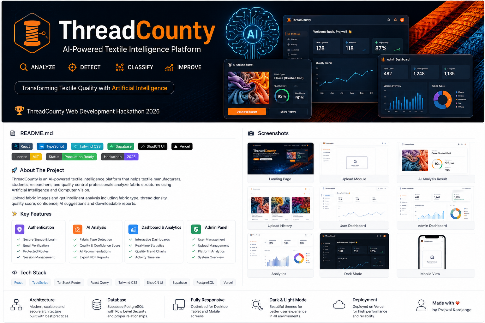


<h1 align="center">
🧵 ThreadCounty
</h1>

<h3 align="center">

AI-Powered Textile Analysis Platform for Smart Fabric Quality Inspection

</h3>

<p align="center">

Modern SaaS Platform for Fabric Quality Analysis using Artificial Intelligence.

</p>

<p align="center">

<a href="https://threadcounty-ai-insights1.vercel.app">

</a>

<a href="https://github.com/prajwalkarajange/threadcounty-ai-insights1">

</a>

</p>

---

## ⭐ Project Highlights

- 🤖 AI Fabric Analysis using Gemini AI
- 📊 Interactive Analytics Dashboard
- 👨‍💻 Complete Admin Panel
- 🔐 Secure Authentication
- 📄 PDF Report Generation
- 📱 Fully Responsive Design
- 🌙 Dark / Light Theme
- ⚡ Production-Ready Full Stack Web Application

# 📑 Table of Contents

- Live Demo
- About
- Features
- Tech Stack
- Screenshots
- Architecture
- Database
- AI Workflow
- Admin Features
- Vision
- Developer


<p align="center">


</p>
---

# ✨ About The Project

**ThreadCounty** is a modern AI-powered textile analysis platform designed for textile manufacturers, students, researchers, and quality control professionals.

Users can securely upload fabric images and receive AI-powered textile insights including fabric identification, quality evaluation, weave analysis, confidence scoring, and downloadable reports through an intuitive web interface.

- Fabric Type
- Quality Score
- Confidence Score
- Texture Analysis
- Color Analysis
- Weave Pattern
- Recommendations
- PDF Report

The platform combines a modern SaaS interface with secure authentication, analytics, role-based administration, and a responsive design.

---
## 🏆 Hackathon Submission

| Category | Details |
|----------|---------|
| Event | ThreadCounty Web Development Hackathon 2026 |
| Project | ThreadCounty |
| Type | Full Stack Web Application |
| Deployment | Vercel |
| Backend | Supabase |
| Frontend | React + TypeScript |

# 🚀 Key Features

### 👤 Authentication

- Secure Login
- User Registration
- Protected Routes
- Role-Based Access
- Session Management

---

### 🧵 AI Fabric Analysis

- Upload Fabric Images
- AI-Based Fabric Identification
- Confidence Score
- Quality Score
- Texture Detection
- Color Analysis
- Weave Pattern Detection
- Recommendations
- PDF Export

---

### 📚 Upload History

- Search Reports
- Card View
- Table View
- Delete Reports
- View Detailed Analysis

---

### 📊 User Dashboard

- Total Uploads
- Recent Activity
- Average Quality
- Quality Graph
- Quick Navigation

---

### 🛠 Admin Dashboard

- User Management
- Upload Management
- AI Analysis Management
- Analytics Dashboard
- Platform Statistics

---

### 📈 Analytics

- Total Users
- Total Uploads
- Total AI Analyses
- Average Quality
- Fabric Distribution
- AI Statistics
- Recent Activity

---

### 🎨 UI / UX

- Responsive Design
- Mobile Friendly
- Dark Mode
- Light Mode
- Modern SaaS Layout
- Smooth Animations

---


## 🛠 Tech Stack

| Frontend     | Backend                 | Database     | AI                 | Deployment |
| ------------ | ----------------------- | ------------ | ------------------ | ---------- |
| React 19     | Supabase Edge Functions | PostgreSQL   | Gemini AI          | Vercel     |
| TypeScript   | Supabase Auth           | Supabase     | Google Gemini AI   | GitHub     |
| Tailwind CSS | REST APIs               | Storage      | Prompt Engineering | GitHub     |
| ShadCN UI    | Role Based Auth         | RLS Policies | AI Reports         | Production |

# ⚙️ Installation

```bash
git clone https://github.com/prajwalkarajange/threadcounty-ai-insights1

cd threadcounty-ai-insights1

npm install

npm run dev
```


# 🔐 Environment Variables

```env
VITE_SUPABASE_URL=

VITE_SUPABASE_ANON_KEY=

VITE_GEMINI_API_KEY=
```

# 📂 Project Structure

```text
threadcounty-ai-insights1
│
├── README/
├── public/
├── src/
│   ├── components/
│   ├── hooks/
│   ├── integrations/
│   ├── routes/
│   ├── styles/
│   ├── lib/
│   ├── assets/
│   └── utils/
├── supabase/
├── package.json
└── README.md
```

# 📌 Project at a Glance

| Feature            | Status |
| ------------------ | ------ |
| Authentication     | ✅     |
| AI Fabric Analysis | ✅     |
| Upload History     | ✅     |
| Admin Dashboard    | ✅     |
| Analytics          | ✅     |
| PDF Export         | ✅     |
| Responsive Design  | ✅     |
| Dark / Light Mode  | ✅     |
| Mobile Friendly    | ✅     |

## 📈 Platform Statistics

- 10+ Responsive Pages
- 25+ Reusable Components
- Secure Authentication
- AI Powered Analysis
- Responsive Dashboard
- Admin Analytics
- Mobile Responsive

# 📸 Application Preview

## 🏠 Landing Page

<p align="center">
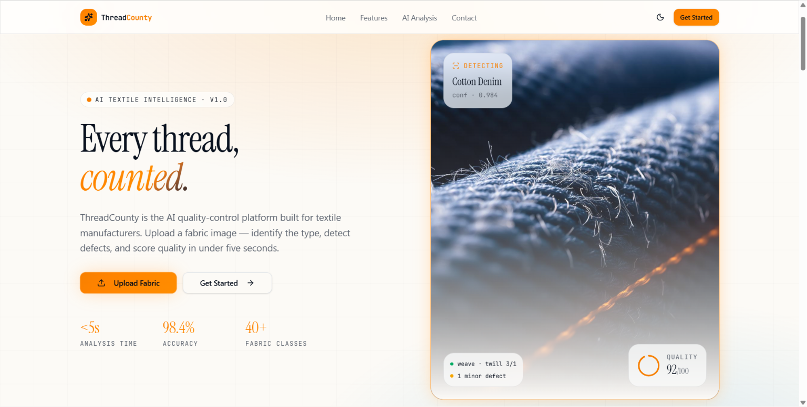
</p>

---

## 📤 Fabric Upload

<p align="center">
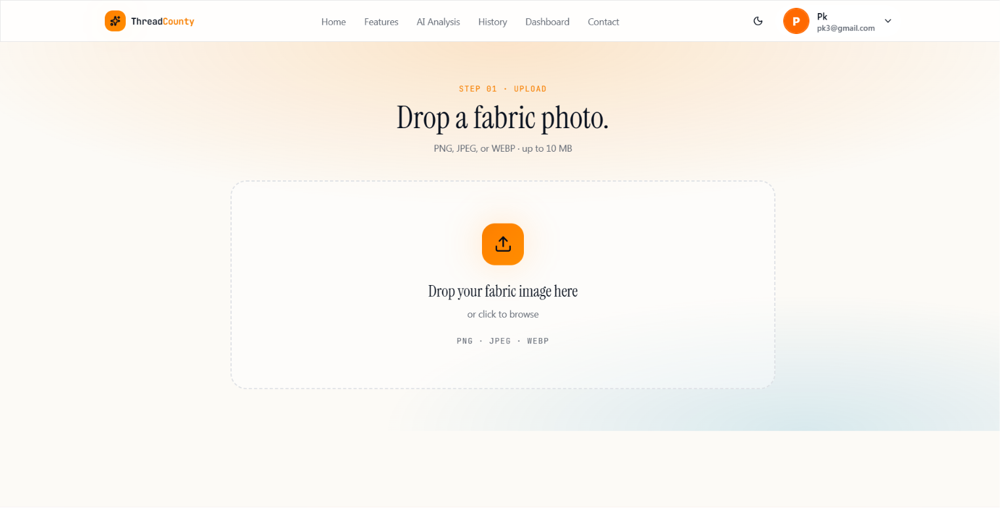
</p>

---

## 🤖 AI Analysis Report

<p align="center">
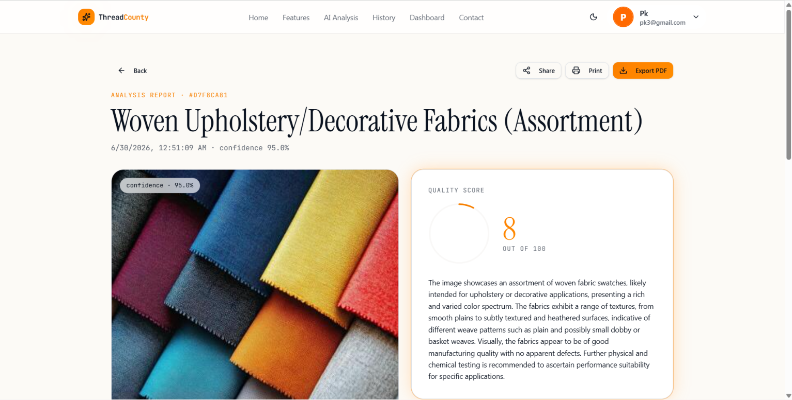
</p>

---

## 📚 Upload History

<p align="center">
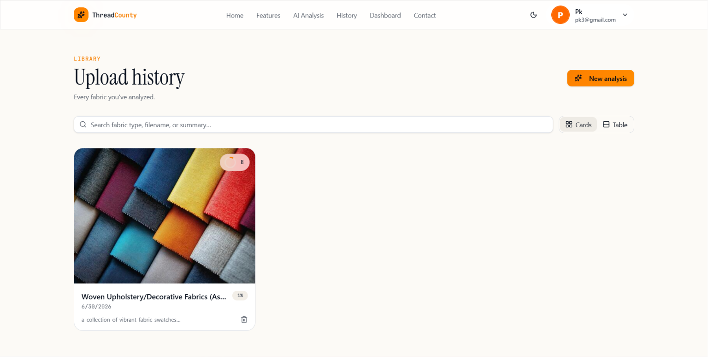
</p>

---

## 📊 User Dashboard

<p align="center">
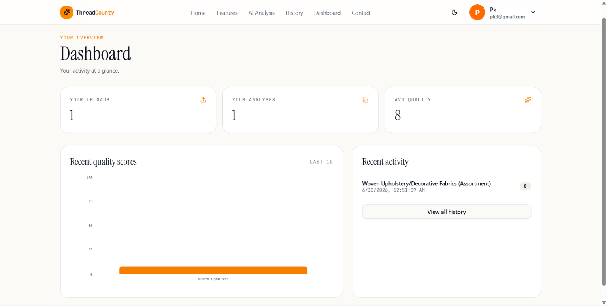
</p>

---

## 👨‍💻 Admin Dashboard

<p align="center">
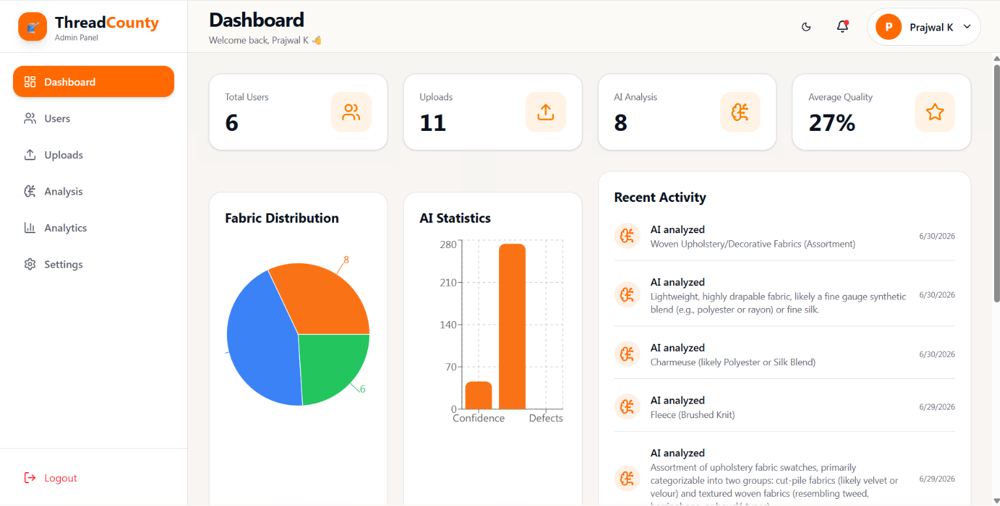
</p>

---

## 📈 Analytics Dashboard

<p align="center">
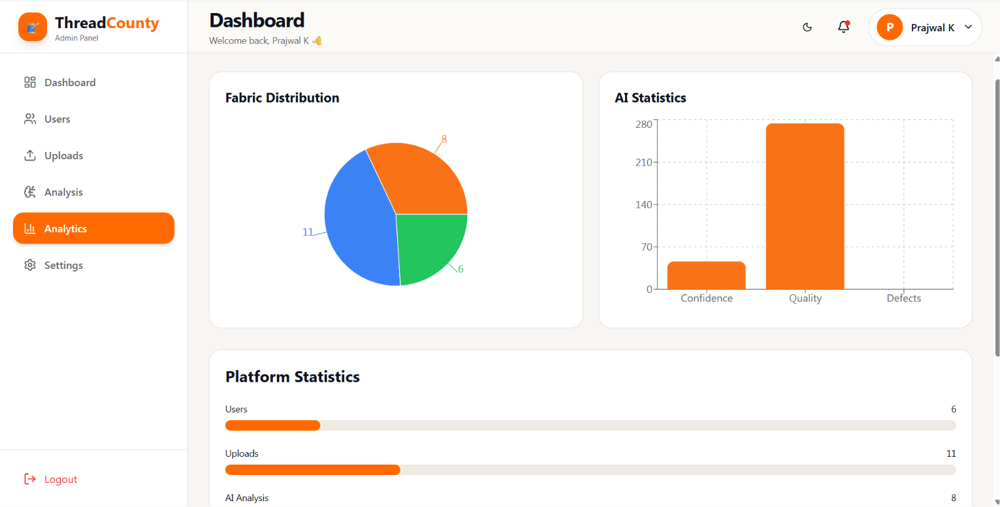
</p>

---

## 👥 User Management

<p align="center">
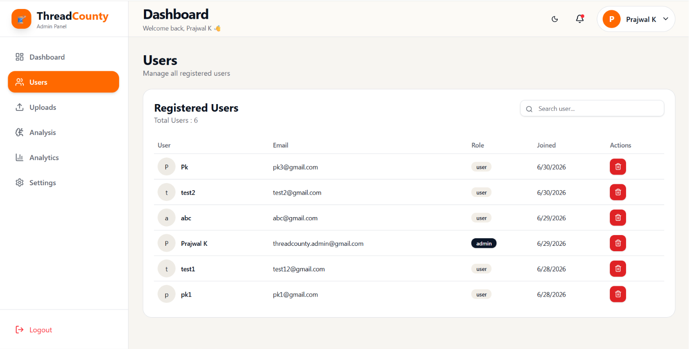
</p>

---

## 🌙 Dark Mode

<p align="center">
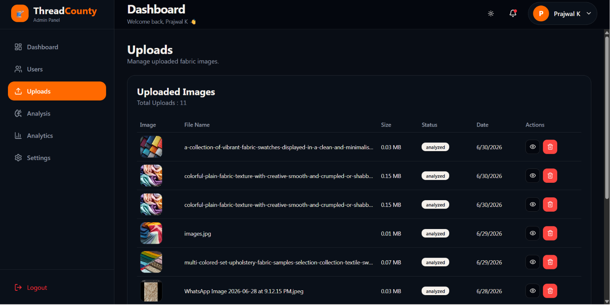
</p>

---

## 📱 Mobile Responsive

<p align="center">
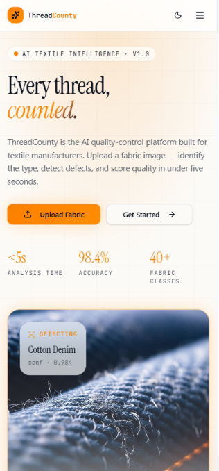
</p>

---

# 🏗 System Architecture

```text
                    User
                      │
                      ▼
            React + TypeScript
                      │
                      ▼
          TanStack Router + ShadCN UI
                      │
                      ▼
              Supabase Authentication
                      │
        ┌─────────────┴─────────────┐
        ▼                           ▼
 Upload Fabric                 User Dashboard
        │                           │
        └─────────────┬─────────────┘
                      ▼
                Gemini AI Analysis
                      │
                      ▼
              AI Analysis Results
                      │
                      ▼
            PostgreSQL (Supabase)
                      │
                      ▼
        Analytics + Admin Dashboard
```

---

# 🗄 Database Schema

## Tables

- profiles
- uploads
- analysis_results
- user_roles

---

### Relationships

```text
profiles
    │
    ├──────── uploads
    │             │
    │             ▼
    │      analysis_results
    │
    ▼
user_roles
```

---

# 🤖 AI Analysis Workflow

```text
Upload Image
      │
      ▼
Validate Image
      │
      ▼
Store in Supabase Storage
      │
      ▼
Gemini AI Analysis
      │
      ▼
Generate Report
      │
      ▼
Store Results
      │
      ▼
Display Dashboard
```

---

# 📊 Admin Features

✔ User Management

✔ Upload Management

✔ AI Analysis Monitoring

✔ Analytics Dashboard

✔ Platform Statistics

✔ Search Users

✔ Delete Records

✔ Role-Based Access

---

## 🎯 Vision

ThreadCounty aims to modernize textile quality inspection by combining Artificial Intelligence, Computer Vision, and cloud technologies into a single intuitive platform.

The platform helps:

- Textile Manufacturers
- Researchers
- Students
- Quality Control Engineers
- Fabric Designers

analyze fabrics quickly, accurately, and efficiently.

## Why ThreadCounty?

⭐ AI-Powered Fabric Analysis

⭐ Production Ready Architecture

⭐ Responsive Across All Devices

⭐ Admin Dashboard

⭐ Secure Authentication

⭐ Analytics System

⭐ PDF Report Generation

⭐ Modern SaaS User Experience

# 🚀 Future Enhancements

- OCR Fabric Detection
- Thread Density Measurement
- AI Chat Assistant
- Multi Language Support
- PWA Support
- Email Notifications
- AI Comparison Tool
- Fabric Recommendation Engine

## 🙏 Acknowledgements

This project was developed for the ThreadCounty Web Development Hackathon 2026.

Special thanks to:

- React
- Supabase
- Tailwind CSS
- ShadCN UI
- Google Gemini AI
- ThreadCounty Team

# 👨‍💻 Developer

**Prajwal Karajange**

B.Tech Information Technology (2023–2027)

University Topper

Full Stack Developer

Java Backend Developer

Passionate about AI, Cloud, and Scalable Web Applications

### Connect

- GitHub: https://github.com/prajwalkarajange
- LinkedIn: https://www.linkedin.com/in/prajwalkarajange

---

If you found this project interesting, consider giving it a ⭐ on GitHub.
---

## 📄 License

This project is developed for the **ThreadCounty Web Development Hackathon 2026**.

For educational and demonstration purposes.

<p align="center">

Built with ❤️ using React, TypeScript, Supabase and Gemini AI.

Created by Prajwal Karajange

⭐ Thank you for visiting this repository.

</p>
